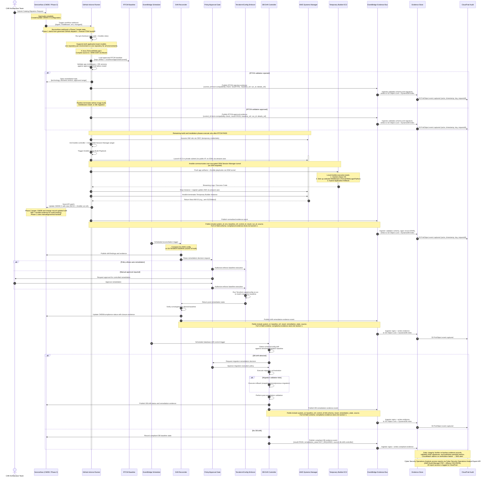

# CI/CD Migration Pipeline — Sequence Diagram

## Diagram

---

## Component Descriptions

| # | Component | Description |
|---|-----------|-------------|
| 1 | **CAR Architecture Team** | The human actor who initiates the process by submitting a migration catalog request and is also the manual approver for controlled remediation decisions. |
| 2 | **ServiceNow (CMDB / Phase 2)** | The entry point where project teams submit migration requests; it manages CMDB CI configuration, approvals, change records, and receives status updates throughout the pipeline. |
| 3 | **GitHub Actions Runner** | The central orchestration engine that coordinates all pipeline stages—from code checkout and RTCM validation to Ansible playbook execution, AMI registration, and evidence publishing. |
| 4 | **RTCM Baseline** | The approved runtime compatibility matrix (stored as a repo artifact and mirrored in SSM Parameter Store) that GitHub Actions queries to validate declared middleware and DB versions before any build proceeds. |
| 5 | **EventBridge Scheduler** | The time-based trigger that fires scheduled reconciliation jobs for both infrastructure drift detection and database drift detection at configured intervals. |
| 6 | **Drift Reconciler** | The component that compares live AWS configuration against the Git Terraform baseline (source of truth) to detect infrastructure drift and verify post-remediation convergence. |
| 7 | **Policy/Approval Gate** | The decision point that evaluates whether drift remediation can be auto-approved or must be escalated to the project team for manual approval before enforcement is authorized. |
| 8 | **Terraform/Config Enforcer** | The executor that runs `terraform apply` or config re-runs to bring live infrastructure back in line with the repository baseline after remediation is authorized. |
| 9 | **DB Drift Controller** | The dedicated controller that detects schema or configuration drift against the versioned migration baseline and orchestrates migration execution, rollback, and post-remediation validation for databases. |
| 10 | **AWS Systems Manager (SSM)** | The AWS control-plane service used for OIDC-based IAM role assumption, launching EC2 instances in private subnets, providing encrypted Session Manager tunnels (no SSH), and registering golden AMIs. |
| 11 | **Temporary Builder EC2** | A short-lived EC2 instance (no public IP, no SSH) launched in a private subnet where the local Ansible execution hardens the OS, installs middleware, and injects application artifacts to produce the golden image. |
| 12 | **EventBridge Evidence Bus** | The event routing layer that receives normalized compliance evidence events from all pipeline components and forwards them to the Evidence Store ingestor for validation and persistence. |
| 13 | **Evidence Store** | The immutable compliance record repository that validates event schemas, signs records with KMS, and writes them to S3 Object Lock (append-only) with a DynamoDB index for query access. |
| 14 | **CloudTrail Audit** | The AWS audit log that automatically captures every S3 `PutObject` event (actor, timestamp, key, requestId) as evidence records are written, and logs all auditor report access. |
