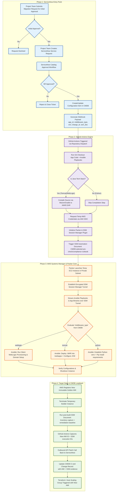

# Process Flow Diagram

```mermaid
graph TD
    %% Styling / Themes
    classDef intake fill:#E3F2FD,stroke:#0D47A1,stroke-width:2px;
    classDef orchestrator fill:#EDE7F6,stroke:#4A148C,stroke-width:2px;
    classDef cloudEngine fill:#FFF3E0,stroke:#E65100,stroke-width:2px;
    classDef targetState fill:#E8F5E9,stroke:#1B5E20,stroke-width:2px;

    %% --- PHASE 1: INTAKE & GOVERNANCE ---
    subgraph Phase 1: ServiceNow Entry Point
        A0[Project Team Submits Migration Request for Initial Approval] --> A1{Initial Approval?}
        A1 -- No --> A2[Request Declined]
        A1 -- Yes --> A[Project Team Creates ServiceNow Service Request]
        A --> B(ServiceNow Catalog Approval Workflow)
        B --> C{SR Approved?}
        C -- No --> D[Reject & Close Ticket]
        C -- Yes --> E[Create/Update Configuration Item in CMDB]
        E --> F[Generate Webhook Payload <br> app_id, middleware_type, env, change_id, ssm_doc]
    end
    class A0,A1,A2,A,B,C,D,E,F intake;

    %% --- PHASE 2: PIPELINE ORCHESTRATION ---
    subgraph Phase 2: GitHub Actions Engine
        F --> G[GitHub Actions Triggered via Repository Dispatch]
        G --> H[Run Git Checkout <br> App Code + Ansible Playbooks]
        H --> I{Is Java Tech Stack?}
        I -- Yes (Tomcat/WebLogic) --> J[Compile Source via Maven/Gradle to .WAR/.EAR]
        I -- No (Python) --> K[Skip Compilation Step]
        J --> L[Request Temp AWS Credentials via IAM OIDC]
        K --> L
        L --> M[Initialize Packer & SSM Session Manager Plugin]
        M --> M1[Trigger SSM Automation Document <br> CMDB-selected pre-check/compliance runbook]
    end
    class G,H,I,J,K,L,M,M1 orchestrator;

    %% --- PHASE 3: SECURE CLOUD BAKING ---
    subgraph Phase 3: AWS Systems Manager & Packer Core
        M1 --> N[Packer Launches Temp EC2 Instance in Private Subnet]
        N --> O[Establish Encrypted SSM Session Manager Tunnel]
        O --> P[Stream Ansible Playbooks & App Binaries over SSM Tunnel]
        P --> Q{Evaluate 'middleware_type' from CMDB}

        Q -- weblogic --> R1[Ansible: Run Silent WebLogic Provisioning & Domain Setup]
        Q -- tomcat --> R2[Ansible: Deploy .WAR into /webapps + Configure JVM]
        Q -- python --> R3[Ansible: Establish Python venv + Pip install requirements]

        R1 --> S[Verify Configurations & Shutdown Instance]
        R2 --> S
        R3 --> S
    end
    class N,O,P,Q,R1,R2,R3,S cloudEngine;

    %% --- PHASE 4: ASSET SERIALIZATION & FEEDBACK LOOP ---
    subgraph Phase 4: Target State & CMDB Loopback
        S --> T[AWS Registers New Immutable Golden AMI]
        T --> U[Terminate Temporary Builder Instance]
        U --> V[Run post-build SSM Document <br> Inventory capture + remediation baseline]
        V --> W[GitHub Actions Captures New AMI ID + SSM execution IDs]
        W --> X[Outbound API Patch Call Back to ServiceNow]
        X --> Y[Update CMDB CI and Change Record <br> with AMI + SSM evidence]
        Y --> Z[Terraform / Auto Scaling Group Triggered with New AMI]
    end
    class T,U,V,W,X,Y,Z targetState;
```
